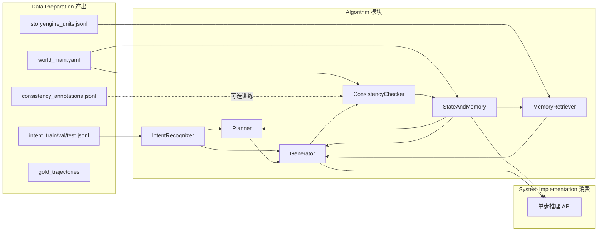

# 二、Algorithm design（算法设计）实现方案

本方案仅覆盖**算法设计阶段**，明确各模块的**输入来源（上游 Data preparation）、输出去向（下游模块或 System implementation）**，以及**接口契约**，便于实现时无缝对接。

---

## 1. 上下游总览

- **上游**：意图数据、剧情单元、一致性标注、WorldBible、金标轨迹均来自 [data/](data/) 下既有路径（见下文各节）。
- **下游**：System implementation 只需调用**单步推理接口**，入参为 `(session_id, user_input)`，出参为 `(narration, choices, state_summary, error_message)`；算法层负责在内部串起意图 → 规划 → 检索 → 生成 → 一致性 → 状态更新。

---

## 2. 与 Data preparation 的衔接（输入约定）

| 算法模块                       | 依赖的 Data preparation 产出 | 路径与用途                                                                                                                                                                      |
| -------------------------- | ----------------------- | -------------------------------------------------------------------------------------------------------------------------------------------------------------------------- |
| 意图识别                       | 意图标注 train/val/test     | [data/annotations/intent_train.jsonl](data/annotations/intent_train.jsonl) 等；训练与评估；`input_text` → `intent_label`（continue/start/fail_forward/meta_help/end/init）           |
| 状态与对话管理                    | WorldBible              | [data/world_bible/world_main.yaml](data/world_bible/world_main.yaml)；定义 GameState 的实体集合（characters, locations, key_items）、rules_forbidden、setting、main_conflict，用于初始化与规则校验 |
| 记忆检索                       | 剧情单元（可选）                | [data/plot_units/storyengine_units.jsonl](data/plot_units/storyengine_units.jsonl)；可选：用 `narrative_text` 或 `world_context_summary` 建索引做 few-shot 或检索示例；运行时记忆以「事件摘要」为主      |
| 一致性检测                      | WorldBible + 一致性标注（可选）  | rules_forbidden、characters/locations 用于规则层；[data/annotations/consistency_annotations.jsonl](data/annotations/consistency_annotations.jsonl) 可选用于训练二分类或构造 LLM 评审 prompt     |
| 规划器 / 生成器                  | WorldBible + 可选剧情单元     | WorldBible 注入 system prompt；剧情单元可作 few-shot 示例（narrative_text + available_choices）                                                                                         |
| 评测（Performance evaluation） | 金标轨迹                    | [data/gold_trajectories/gold_*.json](data/gold_trajectories/)；每步 `player_choice_text` 与 `expected_narration_summary` 用于选择匹配与剧情走向评测，算法输出格式需与之兼容                             |

所有路径均相对于项目根；加载时需做存在性检查与 YAML/JSONL 解析，统一在配置或 `game/config.py` 中声明路径常量。

---

## 3. 各模块设计及衔接

### 3.1 用户意图识别（IntentRecognizer）

- **上游输入**：训练阶段读 [data/annotations/intent_train.jsonl](data/annotations/intent_train.jsonl)（及 val/test）；推理阶段输入为**当前玩家输入文本**（来自 System 的 `user_input`）。
- **方法**：Hugging Face Transformers 序列分类（如 `BertForSequenceClassification` 或 `AutoModelForSequenceClassification`），PyTorch 训练与推理；标签集与 Data preparation 一致：continue, start, fail_forward, meta_help, end, init。
- **输出**：`intent_label: str`、`confidence: float`；可选在低于阈值时回退为默认 `continue`。
- **下游**：意图作为**规划器**与**生成器**的 conditioning（写入 prompt 或 planner 的输入结构）。
- **产出**：模型权重保存路径（如 `models/intent/`）、推理接口 `predict(text: str) -> Tuple[str, float]`；训练脚本读 `intent_*.jsonl`，验证集用于早停与超参。

---

### 3.2 对话管理与状态（StateAndMemory）

- **上游输入**：仅 [data/world_bible/world_main.yaml](data/world_bible/world_main.yaml)；解析得到 `setting`, `characters`, `locations`, `rules_forbidden`, `main_conflict`, `key_items`，用于初始化 GameState 与一致性规则。
- **GameState 结构建议**：`current_location`, `characters_met`, `inventory`（key_items 子集）, `flags`（如 has_permit）, `recent_events[]`（短句列表）, `turn_id`；与 WorldBible 中实体名一致，便于规则检查。
- **Memory**：每步将「本步叙述的 1–2 句摘要」+ 时间戳 + 可选 location/character 标签写入记忆列表；支持按时间取最近 N 条、并按向量相似度取 Top-K（见 3.3）。
- **输出**：对下游暴露「当前 GameState 的序列化」（供规划器与生成器组 prompt）、「记忆列表接口」；对一致性模块暴露 `rules_forbidden` 与实体列表；对 System 暴露 `state_summary`（如当前地点、关键物品、目标一句话）。
- **与 System 衔接**：单步接口返回的 `state_summary` 即由此模块根据当前 GameState 生成；每步结束后用生成器的 `state_updates` 更新 GameState 与 Memory。

---

### 3.3 记忆检索（MemoryRetriever）

- **上游输入**：可选用 [data/plot_units/storyengine_units.jsonl](data/plot_units/storyengine_units.jsonl) 在**启动时**预建索引（如 sentence-transformers 编码 `narrative_text` 或 `world_context_summary`），作为静态参考；**运行时**记忆来自 StateAndMemory 的 `recent_events` 或每步写入的摘要。
- **方法**：sentence-transformers（Transformers + PyTorch）编码「当前状态描述 + 当前意图」为 query，对运行时记忆做向量检索取 Top-K；再与「最近 N 条按时间」拼接，去重后作为一段文本注入生成器 prompt。
- **输出**：一段字符串 `retrieved_context`，供生成器与规划器使用。
- **下游**：仅被 Generator（及可选 Planner）消费；不直接暴露给 System。

---

### 3.4 规划器（Planner）

- **上游输入**：当前 GameState 摘要、当前意图、可选 `retrieved_context`；WorldBible 的 `main_conflict`、`setting` 用于约束方向。
- **职责**：根据状态与意图，产出本步「剧情目标/冲突推进/2–4 个语义不重叠的选项方向」（纯文本或结构化列表），供生成器写入 prompt，减少生成器自由发挥导致选项重复或偏离设定。
- **实现**：可用轻量模板（意图 → 固定选项模板）+ 可选 LLM 单句规划；输出格式与生成器约定（如 `plan_text: str`, `suggested_choices: List[str]`）。
- **下游**：输出仅给 Generator，不直接对 System 暴露。

---

### 3.5 上下文感知文本生成（Generator）

- **上游输入**：WorldBible（setting, characters, locations, rules_forbidden, main_conflict）、当前 GameState 文本、`retrieved_context`、意图、规划器的 `plan_text`/`suggested_choices`、当前 `user_input`。
- **方法**：LLM API 或本地 Transformers 生成模型；system prompt 注入世界观与禁忌，user prompt 注入状态 + 记忆 + 规划 + 玩家输入；**输出格式严格约定为 JSON**：`{"narration": "...", "choices": ["A...", "B...", ...], "state_updates": {"location": "...", "inventory": [...], ...}}`，便于解析与一致性检查。
- **分支策略**：选项数量 2–4；由规划器建议或 prompt 约束；生成后可用简单去重/相似度过滤避免语义重复。
- **输出**：`narration`, `choices[]`, `state_updates`（与 GameState 字段对齐）；若解析失败则重试或返回安全默认叙述。
- **下游**：narration/choices 直接作为单步 API 的 `narration` 与 `choices`；`state_updates` 交给 StateAndMemory 更新，并交给 ConsistencyChecker 做一致性检查。

---

### 3.6 剧情一致性检测（ConsistencyChecker）

- **上游输入**：WorldBible 的 `rules_forbidden`、characters/locations/key_items（实体白名单）；可选 [data/annotations/consistency_annotations.jsonl](data/annotations/consistency_annotations.jsonl) 训练二分类（context + current_narrative → 0/1）。
- **规则层**：实体一致性（叙述中出现的人物/地点/物品须在 WorldBible 或当前 state 中）、状态转移合法（如 inventory 增减合理）、禁忌条款（如「未许可入洞」不得违反）。
- **模型层（可选）**：Transformers 二分类或 LLM 评审（固定 prompt：前文 + 本段 → 是否矛盾 + 理由）；若使用 consistency_annotations，训练时读该文件。
- **输入**：当前「前文摘要/最近叙述」+ 本步 Generator 输出的 `narration`（及可选 `state_updates`）。
- **输出**：`passed: bool`、`reason: str`（不通过时）；不通过则触发 Generator 重生成（最多 2 次），仍失败则回退为简化叙述 + 减少选项。
- **下游**：仅内部与 Generator、StateAndMemory 联动；不直接对 System 暴露。

---

## 4. 实时流水线与对 System 的接口契约

- **流水线顺序**（与 [storyweaver分阶段实现方案](.cursor/plans/storyweaver分阶段实现方案_7b7c902f.plan.md) 一致）：  
`user_input` → **IntentRecognizer** → **Planner**（state + intent）→ **MemoryRetriever**（state + 可选 intent）→ **Generator**（state + retrieved + plan + intent + user_input）→ **ConsistencyChecker**（前文 + narration）→ 通过则 **StateAndMemory** 应用 `state_updates` 并追加记忆 → 返回 narration, choices, state_summary。
- **对 System implementation 的单步接口契约**（下游必须实现或调用）：
  - **入参**：`session_id: str`, `user_input: str`（玩家输入或选项文本）。
  - **出参**：`narration: str`, `choices: List[str]`, `state_summary: str`, `error_message: Optional[str]`。
  - **副作用**：按 session 维护 GameState 与 Memory；首次调用或「新游戏」时用 WorldBible 初始化状态。
  - 实现方式：在算法层提供单一入口函数或类方法（如 `GameEngine.step(session_id, user_input)`），返回上述四元组；Gradio 回调只调用该入口。

---

## 5. 算法层目录与产出（便于与 System 实现对接）

建议在项目根下新增或沿用以下结构，与 [storyweaver分阶段实现方案](.cursor/plans/storyweaver分阶段实现方案_7b7c902f.plan.md) 中「推荐目录」一致：

- **game/**：状态与回合逻辑  
  - `state.py`：GameState 数据结构、从 WorldBible 初始化、应用 `state_updates`。  
  - `memory.py`：记忆列表、摘要写入、按时间/条数截取。  
  - `config.py`：数据路径常量（intent_*.jsonl, plot_units, world_bible, consistency_annotations）。
- **models/**：模型与推理封装  
  - `intent.py`：IntentRecognizer 加载/训练/推理。  
  - `retriever.py`：MemoryRetriever 编码与检索（sentence-transformers）。  
  - `generator.py`：Generator 调用 API 或本地模型、拼 prompt、解析 JSON。  
  - `consistency.py`：ConsistencyChecker 规则 + 可选模型/LLM。
- **prompts/**：生成器与规划器、一致性评审的 prompt 模板（含 WorldBible 占位符）。
- **scripts/**：  
  - 意图模型训练脚本（读 `intent_train/val.jsonl`）；  
  - 可选：一致性二分类训练（读 `consistency_annotations.jsonl`）；  
  - 检索索引预建（读 `storyengine_units.jsonl`，可选）。
- **产出清单**：意图模型权重（如 `models/intent/`）、推理接口、Generator/Consistency 的默认 prompt、单步入口 `GameEngine.step(...)` 或等价函数；设计文档（各模块 I/O、依赖数据路径、超参与阈值）供报告「Algorithm design」小节引用。

---

## 6. 与 Performance evaluation 的衔接

- **选择匹配准确率**：金标轨迹中 `player_choice_text` 与系统实际识别的意图或执行分支对比；算法需保证「选项文本或选项 index 可映射到意图或唯一分支」，以便评测脚本计算准确率。
- **剧情连贯性**：规则层违规率由 ConsistencyChecker 的规则检查次数统计；LLM 评审或人工抽样时，算法输出的 `narration` 与 state 需可复现（固定 seed/session）。
- **响应时间**：单步接口实现处打点（意图/检索/生成/一致性各段耗时），便于评测脚本汇总 P50/P95。

本方案不实现评测脚本，但算法层需预留上述可观测点与输出格式，与 [data/gold_trajectories/](data/gold_trajectories/) 及报告中的指标定义一致。

---

## 7. 实现顺序建议

1. **配置与状态**：读 WorldBible、定义 GameState 与 config 路径 → StateAndMemory 最小可用（初始化 + 应用 state_updates + state_summary）。
2. **意图**：训练 IntentRecognizer（读 intent_*.jsonl）→ 暴露 `predict(text)`。
3. **检索**：实现 MemoryRetriever（运行时记忆 + 可选 plot_units 索引）→ 暴露 `retrieve(state, k)`。
4. **规划器**：实现 Planner（模板或轻量 LLM）→ 输出 plan_text / suggested_choices。
5. **生成器**：实现 Generator（prompt 组装 + JSON 解析 + 重试）→ 输出 narration, choices, state_updates。
6. **一致性**：实现 ConsistencyChecker（规则 + 可选模型/LLM）→ 与 Generator 串联重试与回退。
7. **单步入口**：将上述模块串成 `step(session_id, user_input)`，返回 narration, choices, state_summary, error_message，供 System implementation 的 Gradio 后端调用。

按此顺序可实现「先跑通单步闭环、再补模型与检索质量」的迭代路径，并与上下游阶段清晰衔接。