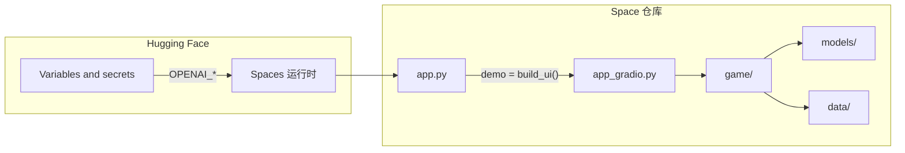

# 将 StoryWeaver 部署到 Hugging Face Spaces

## 部署目标

- **平台**：Hugging Face Spaces（Gradio SDK）
- **入口**：当前应用入口为 [app_gradio.py](app_gradio.py)，通过 `build_ui()` 构建 Gradio Blocks，`main()` 中 `app.launch(server_name="0.0.0.0", server_port=port)` 已在本地兼容端口环境变量。

## 架构与数据流（简要）




## 实施步骤

### 1. 新增 Space 入口文件 `app.py`

Hugging Face Gradio Space 默认会执行入口文件并查找 Gradio 应用对象（如 `demo`）。当前逻辑都在 [app_gradio.py](app_gradio.py) 的 `build_ui()` 中，因此需要一层薄入口，供 Space 使用、且不改变本地 `python app_gradio.py` 的方式。

- **在项目根目录新建 [app.py](app.py)**（仅用于 Space，不替代现有启动方式）：
  - 内容：`from app_gradio import build_ui` 与 `demo = build_ui()`。
  - 不在此文件中调用 `launch()`，由 Spaces 运行时根据 `demo` 启动服务。

这样本地仍用 `python app_gradio.py`；Space 通过 `app_file: app.py`（或在未指定时使用默认 `app.py`）运行。

### 2. 配置 Space 的 README.md（YAML 头）

Spaces 通过 **README.md 顶部的 YAML 块** 配置 SDK、版本、标题等。

- **若项目根目录尚无 README.md**：新建一个，并包含 YAML 配置块。
- **若已有 README.md**：在**文件最顶部**增加以下 YAML 块（注意与正文之间保留空行）：

```yaml
---
title: StoryWeaver
sdk: gradio
sdk_version: "4.0.0"
app_file: app.py
python_version: "3.10"
---
```

- 可选：`emoji`、`colorFrom`/`colorTo`、`short_description`、`tags` 等按需添加，便于在 Space 列表里展示。
- 若意图模型改为从 Hub 加载，可在 YAML 中增加 `models` 或 `preload_from_hub` 以优化冷启动（见下文）。

### 3. 依赖与运行环境

- **依赖**：沿用现有 [requirements.txt](requirements.txt)（含 `gradio>=4.0.0`、`torch`、`transformers`、`sentence-transformers`、`openai`、`huggingface_hub`、`pyyaml`、`python-dotenv` 等）。Space 会据此安装，一般无需改为 Docker。
- **路径**：项目内所有路径均基于「项目根目录」([game/config.py](game/config.py) 中 `_PROJECT_ROOT = Path(__file__).resolve().parents[1]`)。Space 克隆后工作目录即仓库根目录，无需修改路径逻辑。
- **端口**：Space 会注入 `PORT`；当前 [app_gradio.py](app_gradio.py) 的 `main()` 使用 `os.environ.get("PORT", "7860")` 且 `server_name="0.0.0.0"`，仅在使用 `main()` 时生效。Space 实际通过 `demo` 启动，由平台接管端口，无需在代码里再改。

### 4. 密钥与 API 配置（重要）

应用依赖 OpenAI 兼容 API（[.env](.env) 中的 `OPENAI_API_KEY`、`OPENAI_API_BASE`、`OPENAI_MODEL`）。**.env 已列入 [.gitignore](.gitignore)，不能也不应提交到仓库。**

- 在 Hugging Face 对应 **Space 页面**：**Settings → Variables and secrets**。
- 添加以下变量（与本地 .env 一致）：
  - `OPENAI_API_KEY`
  - `OPENAI_API_BASE`（例如 `https://openrouter.ai/api/v1`）
  - `OPENAI_MODEL`（例如 `openai/gpt-4o-mini`）
- 应用内通过 [python-dotenv](app_gradio.py) 和 [generator.py](models/generator.py) 的 `os.environ` 读取；Space 会将上述配置注入为环境变量，无需在代码里写死或读取 .env 文件。

### 5. 数据与资源是否进仓库

- **必须随仓库提交的目录/文件**（供 [game/config.py](game/config.py) 及 engine 使用）：
  - `data/world_bible/`（如 [world_main.yaml](data/world_bible/world_main.yaml)）
  - `data/annotations/`（`intent_train/val/test.jsonl`、[consistency_annotations.jsonl](data/annotations/consistency_annotations.jsonl)）
  - `data/plot_units/`（如 [storyengine_units.jsonl](data/plot_units/storyengine_units.jsonl)）
  - `data/gold_trajectories/`（若评测或演示用到）
- **意图模型 `models/intent/`**：  
  - 当前 [IntentRecognizer](models/intent.py) 从本地目录 [DIR_INTENT_MODEL](game/config.py)（即 `models/intent`）加载；若目录不存在会退化为固定意图 "continue"。  
  - [.gitignore](.gitignore) 中忽略了 `*.pt`、`*.pth`、`*.bin`，因此若用 [scripts/train_intent.py](scripts/train_intent.py) 保存的权重是 `.bin` 等，默认不会被提交。  
  - **二选一**：  
    - **方案 A**：将训练好的 `models/intent/` 提交到 Space 仓库（需在 .gitignore 中为 `models/intent/` 做例外，或使用 `git add -f` 并提交），以便 Space 使用完整意图识别。  
    - **方案 B**：不提交权重，Space 仅用默认意图 "continue"（功能降级但可运行）。
  - 若希望不增大仓库体积，可后续将意图模型上传到 Hugging Face Model Hub，在 [models/intent.py](models/intent.py) 中改为从 Hub 的 `from_pretrained("your-org/your-intent-model")` 加载，并在 README 的 `preload_from_hub` 或 `models` 中声明，以优化冷启动。

### 6. 创建 Space 并推送代码

- 在 [huggingface.co/new-space](https://huggingface.co/new-space) 创建新 Space：
  - **SDK**：Gradio  
  - **仓库名**：如 `StoryWeaver` 或 `storyweaver-demo`
- 推送方式二选一：
  - **方式 A**：用 HF CLI 在本地登录后，将本仓库 push 到该 Space 的 Git 地址（Space 创建后会显示 `git clone https://huggingface.co/spaces/<your-username>/<space-name>`，对应 push 地址一致）。
  - **方式 B**：将项目先放到 **GitHub**，在 Space 的 **Settings → Repository** 中连接该 GitHub 仓库并同步（若 HF 支持从 GitHub 导入/同步）。
- 确保上述 `app.py`、README.md YAML、`data/` 与（若选方案 A）`models/intent/` 均已在提交中。

### 7. 部署后验证

- 在 Space 的 **App** 页查看是否正常启动；若构建/启动失败，查看 **Logs**。
- 点击「开始」后若叙述不变或出现“未配置 API key”类提示，多为 **Variables and secrets** 未设或名称不一致（必须为 `OPENAI_API_KEY` 等），请对照 [generator.py](models/generator.py) 与 [.env](.env) 中的变量名。
- 若需本地复现 Space 环境，可在无 `.env` 的情况下设置相同环境变量后执行 `python app_gradio.py` 或 `python app.py`（若在 app.py 中加一行 `if __name__ == "__main__": demo.launch(server_name="0.0.0.0", server_port=int(os.environ.get("PORT", 7860)))` 也可本地用 app.py 启动）。

## 可选优化

- **硬件**：当前 retriever 使用 [sentence-transformers](models/retriever.py)（如 `all-MiniLM-L6-v2`），意图模型为小型分类器，默认 CPU 即可。若后续使用更大模型，可在 README YAML 中设置 `suggested_hardware: cpu-upgrade` 或相应 GPU。
- **预加载**：若意图模型改为从 Hub 加载，可在 README 的 YAML 中配置 `preload_from_hub`，缩短首次请求延迟。

## 文件变更小结


| 操作    | 文件                                                                    |
| ----- | --------------------------------------------------------------------- |
| 新建    | `app.py`（仅包含 `from app_gradio import build_ui` 与 `demo = build_ui()`） |
| 新建或修改 | 根目录 `README.md`（顶部增加/保留 Space 用 YAML 块，并设置 `app_file: app.py`）        |
| 可选    | `.gitignore`：若采用「提交 models/intent」方案，为 `models/intent/` 增加例外          |
| 不提交   | `.env`（已忽略）；密钥仅在 Space 的 Variables and secrets 中配置                    |


按以上步骤即可在 Hugging Face 上部署并运行 StoryWeaver，无需改动机器人逻辑或数据路径，仅增加入口与配置。